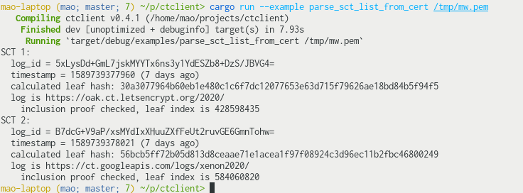
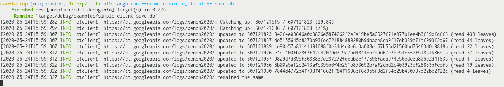

# &#x1F512; [Certificate Transparency](https://www.certificate-transparency.org/) Log client library

&nbsp;&nbsp;

Certificate Transparency Log client suitable for monitoring, quick SCT validation, gossiping, etc.

(Not a full-fledged client with UI and everything - will work on that later. This is just a library to make your own client with.)

## Build requirement

OpenSSL >= 1.1.0

## Features

* Monitor tree head update
* Verify consistency and inclusion proof
* Verify Signed Tree Head (STH) and Signed Certificate Timestamp (SCT)
* Construct leaf hash from SCT and check inclusion
* Low and high level API
* Extract SCT from certificate
* Lots of comment in code intended as reference for other hackers!

## TODOs

* **Implement gossiping protocols**
* Use async IO (currently all API requests are blocking)
* A helper to monitor multiple logs simultaneously
* Certificate submission
* More test coverage

## Examples & DEMOs

Note that you can run those by <code>cargo run --example <i>name</i></code>

* `examples/parse_sct_list_from_cert.rs`: Parse a certificate with a "CT Precertificate SCTs" extension and print out the SCTs. Also check that the logs can provide an inclusion proof for those leafs based on the latest tree head.

	

* `examples/live_stream_domains.rs`: Read out certificates as they are published by a log and print out the CA and domain names.

	DEMO at the top of this README.

* `examples/simple_client/simple_client.rs`: A simple SQLite-backed CT log client monitoring a single log.

	* Check that the tree is consistent (extend-only) each time a new tree head is received.
	* Download and inspect all certificates searching for a hard-coded domain name.
	* Store tree heads and matched certificates in SQLite database.
	* Intended to be a base on which more sophisticated clients can be built.

	
